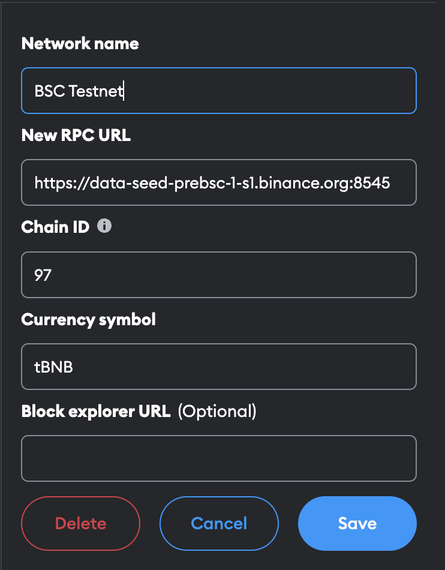
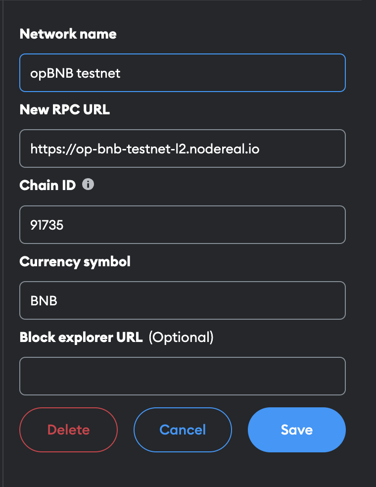

# Getting Started

Developing on opBNB, an optimistic rollup Layer 2 scaling solution for BNB Smart Chain, is nearly the same as building directly on BNB Smart Chain. opBNB uses an EVM execution engine, meaning decentralized applications can be migrated from Ethereum, BNB Smart Chain, Polygon, and other EVM-compatible chains without changing any code.Some key points to highlight: 

1. opBNB is an optimistic rollup - it scales BNB Smart Chain by bundling transactions off-chain and using fraud proofs to ensure validity. This allows for much higher throughput than the underlying BNB Smart Chain.
2. opBNB uses the EVM, the same virtual machine used by Ethereum and BNB Smart Chain. This means any dApp, smart contract, or other application that runs on the EVM can operate on opBNB with little to no code changes. Developers can simply deploy the same application on opBNB to get the benefits of Layer 2 scaling.
3. dApps and smart contracts can migrate to opBNB from any other EVM chain like Ethereum, BNB Smart Chain, or Polygon. Again, since opBNB is EVM-compatible, the applications will run as-is on the new network.
4. Building on opBNB provides the scalability and low costs of a rollup, while still leveraging the security of BNB Smart Chain. dApps get the best of both Layer 1 and Layer 2.


# opBNB testnet information

Network Information

```shell
BSC testnet RPC endpoint: "https://data-seed-prebsc-1-s1.binance.org:8545"
BSC testnet chain ID: 97

opBNB testnet RPC endpoint: "https://op-bnb-testnet-l2.nodereal.io"
opBNB testnet chain ID: 91735

```

To configure your Metamask wallet to work with opBNB, you will need to add both the BNB Smart Chain testnet and the opBNB network. Follow these steps: 1. Add the BNB Smart Chain testnet to your Metamask wallet. This is the Layer 1 blockchain that opBNB is built on top of.

\- Network Name: BNB Smart Chain Testnet
\- New RPC URL: [https://data-seed-prebsc-1-s1.binance.org:8545](https://data-seed-prebsc-1-s3.binance.org:8545/)
\- ChainID: 97
\- Symbol: BNB




2. Add the opBNB network to your Metamask wallet. This is the actual Layer 2 network you will interact with.

   \- Network Name: opBNB Testnet
   \- New RPC URL: [https://op-bnb-testnet-l2.nodereal.io](https://op-bnb-testnet-l2.nodereal.io)
   \- ChainID: [put correct ChainID here]
   \- Symbol: BNB




## Deposit tokens to opBNB

Before building or deploying any applications on the opBNB network, you must first deposit tokens from BNB Smart Chain to opBNB. You can do this using the [opBNB bridge dApp](https://opbnb-testnet-bridge.bnbchain.org/). 

Follow these steps to deposit tokens from BNB Smart Chain to opBNB: 

1. Make sure you have BNB tokens in your Metamask wallet on the BNB Smart Chain testnet. You can get testnet BNB from a faucet.
2. In Metamask, switch your network to BNB Smart Chain Testnet. This is the Layer 1 network where your tokens currently are.
3. Enter the amount of BNB you want to deposit to the opBNB network. For testnet, you can do a small amount like 0.1 BNB.
4. Click "Deposit" to begin the transfer.
5. Metamask will prompt you to confirm the transaction. Click "Confirm" to sign it and pay the required gas fee.
6. Once the transaction is processed, switch your network in Metamask to opBNB Testnet. The BNB amount you deposited will appear in your wallet.
7. You can now build, deploy, and interact with dApps on the opBNB network using the BNB you deposited. To withdraw tokens from opBNB back to BNB Smart Chain, simply go to the bridge, enter the amount to withdraw, and confirm the transaction in Metamask. The bridge will transfer your tokens from the opBNB network back to the BNB Smart Chain testnet.


## How to connect with opBNB and start building


## Make your smart contract on opBNB