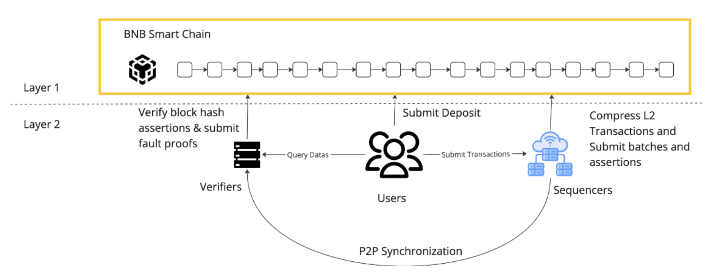

# opBNB - High-performance layer 2 solution 

The opBNB network is a Layer 2 scaling solution built on top of the BNB Smart Chain. It works by offloading transaction processing and resource usage from the BNB Smart Chain, while still posting data to the underlying mainnet. Users interact with the opBNB network by depositing funds from BSC and using applications and contracts on opBNB. Sequencers then aggregate transactions, compute state transitions and submit them to the rollup contract on BSC. Provers generate cryptographic proofs that prove the validity of these state transitions, and Verifiers check the proofs to verify the opBNB state is correct. At its core, opBNB allows users to deposit and withdraw funds, use smart contracts, and view network data with high throughput and low fees. By leveraging Layer 2, opBNB is able to scale beyond the constraints of the BNB Smart Chain and provide an improved experience for users.

## Architecture of opBNB

The opBNB is a layer 2 scaling solution built on top of BSC (a layer 1 blockchain). It processes transactions off-chain but posts transaction data on-chain, providing scalability as compressed layer 2 transaction data are posted on-chain. It has three main layers: an RPC service layer for interacting with the rollup, an operator interface layer for proposing layer 2 transactions off-chain, and an execution layer for executing transactions and providing an EVM execution environment. 

The rollup has a modular design, so the data availability interface and settlement layer can be implemented with different solutions. The data availability layer can be replaced with solutions like Greenfield, Arweave, and others, instead of relying only on BSC. Likewise, the settlement layer can be replaced with other EVM-compatible chains besides BSC, such as the Ethereum mainnet. 

The rollup is secured by its settlement chain as transaction data is posted on-chain, benefits from its consensus, and uses its data availability solutions. It is decentralized and permissionless. The rollup provides faster and cheaper transactions than BSC while still being secured.
